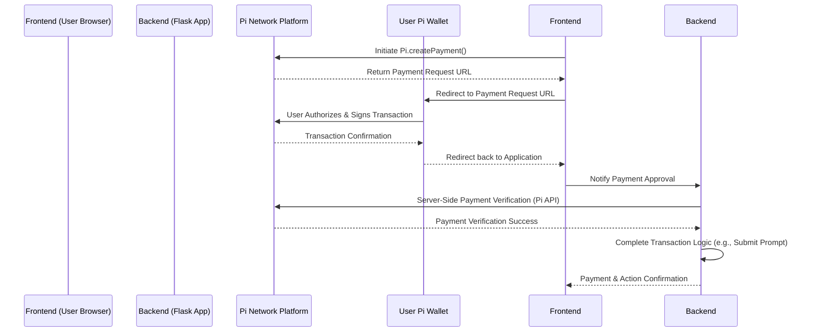

# Pi Network Weekly Prompts Application

**Platform Categories (Subject to Community Vote)**

| Category Name         | Description                                                                                                                                                                                                                                                             | Documentation                                                                                                                                                                                                                                                                                          |
|-----------------------|-------------------------------------------------------------------------------------------------------------------------------------------------------------------------------------------------------------------------------------------------------------------------|------------------------------------------------------------------------------------------------------------------------------------------------------------------------------------------------------------------------------------------------------------------------------------------------|
| **DeepSeek R1 Prompts** | Prompts designed for use with the DeepSeek R1 generative model. This category focuses on general creative prompts for text and potentially image generation, leveraging the capabilities of DeepSeek R1.                                                                | N/A                                                                                                                                                                                                                                                                                              |
| **Claude 3.7 Prompts** | Prompts optimized for Anthropic's Claude 3.7 model. This category will explore the strengths of Claude 3.7 in areas like creative writing, complex reasoning, and conversational AI.                                                                                   | N/A                                                                                                                                                                                                                                                                                              |
| **Perplexity Prompts**  | Prompts intended for use with the Perplexity AI platform, focusing on information retrieval, research, and question answering. This category will explore prompts that leverage Perplexity's search and summarization capabilities.                                   | N/A                                                                                                                                                                                                                                                                                              |
| **GitHub Copilot Prompts**| Prompts tailored for GitHub Copilot, focusing on enhancing code generation and developer workflows.  This includes: <br> - **Reusable Prompt Files:** For `settings.json`, `.github/copilot-instructions.md` to customize Copilot's behavior across projects.<br> - **Specific Prompts:** From `.github/prompts` folder, for project-specific prompt engineering. | [GitHub Copilot Customization Documentation](https://code.visualstudio.com/docs/copilot/copilot-customization#_reusable-prompt-files-experimental)                                                               |

*Please note: The platform categories listed above are initial categories and are subject to change based on community feedback and voting. We believe in a community-driven approach and will adapt the platform categories to best serve the interests and preferences of our users.*

This repository contains a Flask-based web application designed to engage Pi Network users through weekly creative prompts. Users can submit prompts, vote for their favorites, and participate in a staking mechanism using Pi currency. This application leverages the Pi Network SDK and API to seamlessly integrate with the Pi ecosystem.

This README is intended for developers interested in contributing to or understanding the technical aspects of this project.

**Vision:** This project aims to provide a valuable and engaging utility within the Pi Network ecosystem, fostering community interaction and creativity.  It leverages the strengths of Pi Network to offer a seamless and incentivized platform for prompt-based competitions. We believe this application has significant potential for user adoption and can serve as a model for community-driven initiatives within decentralized ecosystems.

## Key Features for Collaborators

*   **Weekly Prompt Cycle:**  Automated system for initiating weekly prompts, accepting user submissions, and concluding cycles with winner selection.
*   **Multi-Category Prompt Support:** The platform will feature different categories for prompts, catering to various AI models and platforms. Initially, these categories will include prompts for general generative models like DeepSeek R1 and Claude 3.7, as well as prompts tailored for platforms like Perplexity and even specialized code generation prompts for GitHub Copilot.
*   **Pi Network Authentication:** Secure user authentication via Pi Network's decentralized identity system using `Pi.authenticate()`.
*   **Voting and Ranking:** Robust voting mechanism to allow the community to curate the best prompts, leading to a weekly leaderboard.
*   **Pi Staking for Submissions:**  Users commit Pi to participate, creating a tangible incentive and prize pool. Integrates `Pi.createPayment()` for transactions.
*   **Prize Distribution:** Automated prize distribution system to reward top-voted prompt creators at the end of each week.
*   **Flask Framework:** Built on the lightweight and flexible Flask framework for web application development.
*   **SQLAlchemy ORM:** Utilizes SQLAlchemy for efficient and scalable database management, supporting both SQLite (development) and PostgreSQL (production).
*   **Open Source Philosophy:**  This project embraces the open-source ethos, aiming to contribute to a free and collaborative internet. We encourage community contributions and believe in the power of collective effort.
*   **Community Interaction:** Designed to foster strong community engagement through regular prompts, voting, and potential for future features like community polls and referendums.
*   **Data Collection & Prompt Engineering Potential:**  The application architecture allows for the collection of a valuable dataset of user-submitted prompts. This data, potentially classified through user voting (acting as a form of Reinforcement Learning from Human Feedback - RLHF), could be leveraged in the future for training advanced prompt engineering models.
*   **Ease of Setup & Minimal Interaction Design:** The application is designed for relatively easy setup and aims for a streamlined user experience with minimal friction.

## Technical Deep Dive

This section provides a deeper look into the technologies and architecture of the application.

### Technology Stack

*   **Backend:** Python 3.7+ with Flask framework.
*   **Database:** SQLAlchemy ORM supporting SQLite (default for development) and PostgreSQL (recommended for production).
*   **Frontend:**  Basic HTML/CSS/JavaScript (Flask templating with Jinja).  Flask-Bootstrap is used for basic styling.
*   **Pi Network Integration:**  Pi Network SDK and Platform API for authentication and payments.

### System Architecture

The application follows a standard Model-View-Controller (MVC) pattern within the Flask framework.

**Components:**

*   **Flask Routes & Templates:**  Handles user requests, renders HTML templates, and interacts with the backend logic.
*   **Flask App (app.py):**  The core application logic, routing, business logic, and interaction with models and Pi Network integration.
*   **SQLAlchemy Model (models.py):** Defines the database schema and provides an interface for data access and manipulation.
*   **Pi Network SDK/API (pi_integration.py):**  Encapsulates the logic for interacting with the Pi Network for authentication and payments. We've found the Pi Network API to be well-designed and robust, simplifying integration.
*   **Database (SQLite/PostgreSQL):** Stores application data including users, prompts, votes, and staking information.
*   **Pi Network Platform:** The external platform for Pi Network user authentication and payment processing.  Security for payments and authentication is largely handled by the Pi Network Platform itself, reducing the complexity for application developers.

### Pi Network Payment Flow

The application implements the recommended Pi Network payment flow to ensure secure and reliable transactions.



**Payment Flow Steps:**

1.  **Payment Creation (Frontend):** The frontend initiates a payment request using `Pi.createPayment()`, specifying payment details.
2.  **Payment Request URL (Pi Platform):** Pi Network Platform returns a URL to redirect the user for payment authorization.
3.  **User Authorization (User Wallet):** The user is redirected to their Pi Wallet to authorize and sign the transaction.
4.  **Transaction Confirmation (Pi Platform & User Wallet):** Pi Network Platform confirms the transaction to the user's wallet.
5.  **Payment Approval Notification (Frontend to Backend):** Frontend notifies the backend that the payment process has been initiated.
6.  **Server-Side Verification (Backend):** The backend securely verifies the payment with the Pi Network Platform API using the Server API Key.
7.  **Payment Verification Success (Pi Platform to Backend):** Pi Network Platform confirms the payment verification.
8.  **Complete Transaction Logic (Backend):** Upon successful verification, the backend completes the application-specific transaction (e.g., registering the prompt submission).
9.  **Confirmation (Backend to Frontend):** The frontend is updated to reflect the successful payment and action completion.

## Getting Started - Setup for Development

To get started with development, follow these steps:

### Prerequisites

*   **Python 3.7 or higher:** Ensure you have Python installed.
*   **Pi Network Developer Account:**  Required to register your application and obtain necessary API keys. Access the portal at `pi://develop.pi`.
*   **Pi Network App Registration:** Register your application in the Pi Developer Portal. Configure:
    *   **App Network:** Use Testnet for development.
    *   **App URL and Domain:** Set to your development environment URL (e.g., `http://localhost:3000`).
    *   **App Wallet:** Connect a test wallet for development payments.
    *   **Permissions:** Request `username`, `payments`, and `wallet_address` permissions.

### Installation and Configuration

1.  **Clone Repository:**
    ```bash
    git clone <repository_url>
    cd <repository_directory>
    ```

2.  **Install Python Packages:**
    ```bash
    pip install -r requirements.txt
    ```
    *(If `requirements.txt` doesn't exist, use: `pip install flask flask-bootstrap flask-sqlalchemy requests gunicorn`)*

3.  **Environment Variables:** Set the required environment variables. For development, you can use `.env` file or export directly in your terminal:
    ```bash
    export DATABASE_URL="sqlite:///dev.db"  # For SQLite development database
    export PI_API_KEY="your_test_server_api_key_here" # From Pi Developer Portal (Testnet Key)
    ```
    **Note:** For production, use PostgreSQL and a strong Server API Key from your Mainnet app in the Pi Developer Portal.

4.  **Configuration in `app.py`:**
    *   Ensure `SANDBOX_MODE = True` is set in `app.py` for development with the Pi Testnet.

### Database Setup

*   For development with SQLite, the database file `dev.db` will be automatically created in the application directory on the first run. No manual setup is needed.
*   For production with PostgreSQL, you need to set up a PostgreSQL database and update the `DATABASE_URL` environment variable accordingly. SQLAlchemy will handle table creation on the first run.

### Running the Application

**Development Server:**

```bash
python app.py
```
Access the application at `http://localhost:3000`.

**Production Server (using Gunicorn - Recommended):**

```bash
gunicorn app:app -w 4 -b 0.0.0.0:5000
```
*(Ensure you have Gunicorn installed: `pip install gunicorn`)*

## Weekly Prompt Workflow

This outlines the weekly cycle of prompt submissions, voting, and winner selection.  An administrative interface is planned to further streamline and automate this workflow, enabling easy management of prompts and competitions.

1.  **Prompt Initiation (Admin):**  A new weekly prompt is initiated (typically by an administrator through the admin interface), specifying the category (e.g., DeepSeek, Claude, Perplexity, Copilot).
2.  **Prompt Submission (Users):** Users submit their creative prompts, staking a small amount of Pi. **Initially, users will also be required to submit a link or a screenshot demonstrating the output generated by their prompt on the specified platform.**
3.  **Voting Period (Users):** Users vote for their favorite submitted prompts.
4.  **Voting Closure (Automated):** The voting period automatically ends after a set duration (e.g., one week).
5.  **Winner Determination (Automated):** The application automatically determines the top-voted prompt(s) based on vote count.
6.  **Prize Distribution (Automated):**  The prize pool (accumulated Pi from staking) is distributed to the winner(s), potentially to the top 3-10 submissions.
7.  **Leaderboard Update (Automated):**  The weekly leaderboard is updated to reflect the winning prompts.
8.  **Cycle Reset (Automated):** The system resets for the next weekly prompt cycle.

**GitHub Copilot Prompt Category:** For prompts designed for GitHub Copilot, users can submit various types of prompts, including:
*   **Reusable Prompt Files:** These can be used in `settings.json`, `.github/copilot-instructions.md`.
*   **Specific Prompts from `.github/prompts` folder:**  For more information on customizing GitHub Copilot prompts, refer to the [official documentation](https://code.visualstudio.com/docs/copilot/copilot-customization#_reusable-prompt-files-experimental).

## Development vs. Production Environments

| Feature           | Development (Testnet)              | Production (Mainnet)               |
| ----------------- | ------------------------------------ | ------------------------------------- |
| **Database**      | SQLite (default)                     | PostgreSQL (recommended)             |
| **Pi Network**    | Testnet                               | Mainnet                               |
| **Sandbox Mode**  | `SANDBOX_MODE = True` in `app.py`   | `SANDBOX_MODE = False` in `app.py`  |
| **API Key**       | Test Server API Key                  | Production Server API Key             |
| **Security**      | Less stringent, for local testing   | High importance, SSL/TLS, rate limiting |

## Security Best Practices

When deploying to production, ensure the following security measures are implemented.  While Pi Network handles core security aspects of authentication and payments, application-level security remains crucial, especially for the planned administrative interface.

*   **Secure API Key Management:**  **Never hardcode the Server API Key.** Use environment variables and secure vault mechanisms in production.
*   **HTTPS/TLS:**  Enforce HTTPS for all connections to protect sensitive data in transit.
*   **Environment Variables:**  Utilize environment variables for all sensitive configuration parameters (database credentials, API keys, etc.).
*   **Rate Limiting:** Implement rate limiting to prevent abuse and denial-of-service attacks.
*   **Input Validation:**  Sanitize and validate all user inputs to prevent injection vulnerabilities.
*   **Regular Security Audits:** Conduct periodic security audits and penetration testing to identify and address potential vulnerabilities, particularly concerning the administrative interface.
*   **Keep Dependencies Updated:** Regularly update Python packages and dependencies to patch known security flaws.

## Incentives and Revenue Potential

This project offers a unique opportunity to build a valuable service within the Pi Network ecosystem with strong inherent incentives:

*   **Revenue Sharing for Talent:** The prize pool mechanism allows for direct financial rewards (in Pi currency) for talented prompt creators.  Future iterations may explore distributing the prize pool to a wider range of top submissions (e.g., top 3-10).
*   **Potential for Reliable Income Supplement:** By consistently participating and winning prompts, users can potentially earn a reliable supplementary income in Pi.
*   **Pi Network Mining Rewards:**  Users engaging with the application through the Pi Browser also benefit from Pi Network's native mining rewards, further incentivizing participation.

## Future Enhancements

*   **Automated Response Generation:**  **In future iterations, the platform aims to generate AI responses directly for submitted prompts, removing the initial requirement for users to provide external links or screenshots. This enhancement is dependent on managing the computational costs associated with running AI models.** This will streamline the user experience and allow for more direct comparison and evaluation of prompts within the platform.
*   **Expanded Platform Categories:**  Continuously adding support for more AI models and platforms based on user demand and the evolving landscape of AI technology.
*   **Enhanced Admin Interface:**  Further development of the administrative interface to provide more granular control over prompt cycles, prize distribution, and user management.

## Contributing

We welcome contributions! If you're interested in contributing to this project, please:

1.  Fork the repository.
2.  Create a new branch for your feature or bug fix.
3.  Implement your changes and add tests if applicable.
4.  Submit a pull request with a clear description of your changes.

## Need Help?

If you encounter any issues or have questions, please open an issue in the repository. We are happy to provide assistance and guidance.
